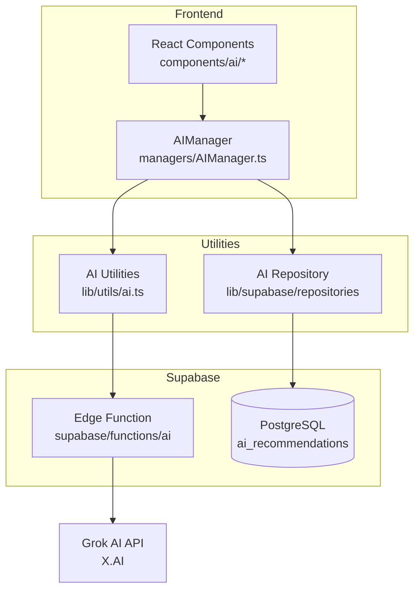

# AI Features Guide

This document explains how the AI features work in the UniPlanner app, including the architecture, file locations, and how to modify or extend them.

## Architecture Overview




---

## Key Files Reference

| Purpose | File Path |
|---------|-----------|
| Edge Function (AI Proxy) | `supabase/functions/ai/index.ts` |
| AI Manager (Orchestrator) | `managers/AIManager.ts` |
| AI Utilities & Prompts | `lib/utils/ai.ts` |
| DB Repository | `lib/supabase/repositories/ai-recommendations.repository.ts` |
| Type Definitions | `lib/types.ts` |
| Supabase Client | `lib/supabase/client.ts` |

### UI Components

| Feature | Page | Component |
|---------|------|-----------|
| Course Scanner | `app/ai/course-scanner/page.tsx` | `components/ai/CourseScanner.tsx` |
| Acceptance Predictor | `app/ai/acceptance-predictor/page.tsx` | `components/ai/AcceptancePredictor.tsx` |
| Portfolio Advisor | `app/ai/portfolio-advisor/page.tsx` | `components/ai/PortfolioAdvisor.tsx` |
| Course Recommender | `app/ai/course-recommender/page.tsx` | `components/ai/CourseRecommender.tsx` |
| Grade Analyzer | `app/ai/grade-analyzer/page.tsx` | `components/ai/GradeAnalyzer.tsx` |

---

## How the Data Flows

### Step 1: User Triggers AI Feature

The user interacts with one of the AI component pages. For example, in `AcceptancePredictor.tsx`:

```typescript
// Component calls the AIManager
const result = await AIManager.predictAcceptance(userId, {
    universityName: formData.university,
    major: formData.major,
    gpa: formData.gpa,
    // ...
});
```

### Step 2: AIManager Coordinates the Request

The `AIManager` class in [managers/AIManager.ts](file:///Users/abhimanyumalik/Desktop/UniPlanner/Ai-Portfolio-App-main/managers/AIManager.ts):

1. Generates a prompt using utility functions
2. Calls the AI with retry logic
3. Parses the response
4. Saves to database for caching

```typescript
static async predictAcceptance(userId, data) {
    // 1. Generate prompt
    const prompt = generateAcceptancePredictionPrompt(data);
    
    // 2. Call AI with retry
    const response = await callAIWithRetry(prompt, {
        featureType: AIFeatureType.AcceptancePrediction,
        temperature: 0.5,
    });
    
    // 3. Parse JSON response
    const result = parseAIResponse<AcceptancePredictionResult>(response);
    
    // 4. Save to database
    await AIRecommendationsRepository.create({/*...*/});
    
    return result;
}
```

### Step 3: AI Utilities Call the Edge Function

In [lib/utils/ai.ts](file:///Users/abhimanyumalik/Desktop/UniPlanner/Ai-Portfolio-App-main/lib/utils/ai.ts):

```typescript
export async function callAI(prompt, options) {
    // Get JWT session for authentication
    const { data: { session } } = await supabase.auth.getSession();
    
    // Call Edge Function with auth header
    const { data, error } = await supabase.functions.invoke('ai', {
        body: { prompt, temperature, max_tokens },
    });
    
    return data.choices[0].message.content;
}
```

### Step 4: Edge Function Proxies to Grok AI

The Edge Function in [supabase/functions/ai/index.ts](file:///Users/abhimanyumalik/Desktop/UniPlanner/Ai-Portfolio-App-main/supabase/functions/ai/index.ts):

```typescript
// Verify JWT authentication
const authHeader = req.headers.get('Authorization');

// Get API key from Supabase secrets
const apiKey = Deno.env.get('XAI_API_KEY');

// Call Grok AI API
const response = await fetch('https://api.x.ai/v1/chat/completions', {
    method: 'POST',
    headers: {
        'Authorization': `Bearer ${apiKey}`,
    },
    body: JSON.stringify({
        model: 'grok-4-1-fast-non-reasoning',
        messages: [{ role: 'user', content: prompt }],
        temperature,
        max_tokens,
    }),
});
```

---

## AI Feature Types

Defined in [lib/types.ts](file:///Users/abhimanyumalik/Desktop/UniPlanner/Ai-Portfolio-App-main/lib/types.ts):

```typescript
enum AIFeatureType {
    CourseExtraction = 'course_extraction',
    AcceptancePrediction = 'acceptance_prediction',
    PortfolioAdvice = 'portfolio_advice',
    CourseRecommendation = 'course_recommendation',
    GradeAnalysis = 'grade_analysis',
}
```

---

## Database Schema

The AI tables are defined in [migrations/add_ai_tables.sql](file:///Users/abhimanyumalik/Desktop/UniPlanner/Ai-Portfolio-App-main/migrations/add_ai_tables.sql):

### `ai_recommendations` Table

Stores AI results for caching and history:

| Column | Type | Description |
|--------|------|-------------|
| `id` | UUID | Primary key |
| `user_id` | UUID | References auth.users |
| `feature_type` | TEXT | One of the AIFeatureType values |
| `input_data` | JSONB | User input snapshot |
| `output_data` | JSONB | AI response data |
| `confidence_score` | NUMERIC | 0-100 confidence |
| `created_at` | TIMESTAMP | Creation time |

### `ai_query_log` Table

Logs all API calls for monitoring:

| Column | Type | Description |
|--------|------|-------------|
| `id` | UUID | Primary key |
| `user_id` | UUID | References auth.users |
| `feature_type` | TEXT | Feature used |
| `prompt_length` | INTEGER | Chars in prompt |
| `response_time_ms` | INTEGER | API latency |
| `status` | TEXT | success/error/timeout |
| `tokens_used` | INTEGER | Token consumption |

> [!IMPORTANT]
> Both tables have **Row Level Security (RLS)** enabled. Users can only access their own data.

---

## How to Modify Prompts

All prompt templates are in [lib/utils/ai.ts](file:///Users/abhimanyumalik/Desktop/UniPlanner/Ai-Portfolio-App-main/lib/utils/ai.ts):

| Function | AI Feature |
|----------|------------|
| `generateCourseExtractionPrompt()` | Course Scanner |
| `generateAcceptancePredictionPrompt()` | Acceptance Predictor |
| `generatePortfolioAdvicePrompt()` | Portfolio Advisor |
| `generateCourseRecommendationPrompt()` | Course Recommender |
| `generateGradeAnalysisPrompt()` | Grade Analyzer |

### Example: Modifying the Acceptance Prediction

1. Open `lib/utils/ai.ts`
2. Find `generateAcceptancePredictionPrompt`
3. Edit the prompt string:

```typescript
export const generateAcceptancePredictionPrompt = (data) => {
    return `
You are an expert college admissions counselor...
// Edit the instructions here

Return a JSON response:
{
    "acceptanceLikelihood": <number 0-100>,
    // Add new fields here
}
`;
};
```

4. Update the TypeScript type in `lib/types.ts`:

```typescript
export interface AcceptancePredictionResult {
    acceptanceLikelihood: number;
    // Add new fields here
}
```

---

## How to Add a New AI Feature

### Step 1: Define Types

Add to [lib/types.ts](file:///Users/abhimanyumalik/Desktop/UniPlanner/Ai-Portfolio-App-main/lib/types.ts):

```typescript
// Add to AIFeatureType enum
export enum AIFeatureType {
    // ...existing...
    MyNewFeature = 'my_new_feature',
}

// Define result type
export interface MyNewFeatureResult {
    // your fields
}
```

### Step 2: Create Prompt Function

Add to [lib/utils/ai.ts](file:///Users/abhimanyumalik/Desktop/UniPlanner/Ai-Portfolio-App-main/lib/utils/ai.ts):

```typescript
export function generateMyNewFeaturePrompt(data: { /* inputs */ }): string {
    return `Your prompt here...
    
Return JSON:
{
    // expected structure
}`;
}
```

### Step 3: Add AIManager Method

Add to [managers/AIManager.ts](file:///Users/abhimanyumalik/Desktop/UniPlanner/Ai-Portfolio-App-main/managers/AIManager.ts):

```typescript
static async myNewFeature(
    userId: UUID,
    data: { /* inputs */ }
): Promise<MyNewFeatureResult> {
    const prompt = generateMyNewFeaturePrompt(data);
    
    const response = await callAIWithRetry(prompt, {
        featureType: AIFeatureType.MyNewFeature,
        temperature: 0.6,  // adjust as needed
    });
    
    const result = parseAIResponse<MyNewFeatureResult>(response);
    
    await AIRecommendationsRepository.create({
        user_id: userId,
        feature_type: AIFeatureType.MyNewFeature,
        input_data: data,
        output_data: JSON.parse(JSON.stringify(result)),
        confidence_score: 75,
    });
    
    return result;
}
```

### Step 4: Update Database Constraint

If the database is strict on feature types, update the CHECK constraint:

```sql
ALTER TABLE ai_recommendations 
DROP CONSTRAINT ai_recommendations_feature_type_check;

ALTER TABLE ai_recommendations 
ADD CONSTRAINT ai_recommendations_feature_type_check 
CHECK (feature_type IN (
    'course_extraction',
    'acceptance_prediction',
    'portfolio_advice',
    'course_recommendation',
    'grade_analysis',
    'my_new_feature'  -- Add new type
));
```

### Step 5: Create UI Component

Create `components/ai/MyNewFeature.tsx`:

```typescript
'use client';

import { useState } from 'react';
import { AIManager } from '@/managers/AIManager';
import { useUser } from '@/hooks/useUser';

export function MyNewFeature() {
    const { data: user } = useUser();
    const [result, setResult] = useState(null);
    
    const handleSubmit = async (formData) => {
        const response = await AIManager.myNewFeature(
            user.id,
            formData
        );
        setResult(response);
    };
    
    return (/* your UI */);
}
```

### Step 6: Create Page Route

Create `app/ai/my-new-feature/page.tsx`:

```typescript
'use client';

import { MyNewFeature } from '@/components/ai/MyNewFeature';

export default function MyNewFeaturePage() {
    return (
        <div className="max-w-4xl mx-auto">
            <MyNewFeature />
        </div>
    );
}
```

### Step 7: Add to AI Tools View

Update [views/AIToolsView.tsx](file:///Users/abhimanyumalik/Desktop/UniPlanner/Ai-Portfolio-App-main/views/AIToolsView.tsx):

```typescript
const tools = [
    // ...existing tools...
    {
        title: 'My New Feature',
        description: 'Description here',
        icon: SomeIcon,
        href: '/ai/my-new-feature',
        color: 'from-orange-500 to-red-500',
        textColor: 'text-orange-600 dark:text-orange-400',
    },
];
```

---

## Configuration

### Environment Variables

The app requires these environment variables:

| Variable | Where Used | Description |
|----------|------------|-------------|
| `NEXT_PUBLIC_SUPABASE_URL` | Frontend client | Supabase project URL |
| `NEXT_PUBLIC_SUPABASE_ANON_KEY` | Frontend client | Supabase anon key |
| `XAI_API_KEY` | Edge Function | Grok AI API key (set via Supabase secrets) |

### Setting Edge Function Secrets

```bash
# Set the Grok API key in Supabase
supabase secrets set XAI_API_KEY=your-xai-api-key
```

### AI Parameters

Each feature can customize:

| Parameter | Default | Description |
|-----------|---------|-------------|
| `temperature` | 0.7 | Creativity (0=precise, 1=creative) |
| `max_tokens` | 2000 | Max response length |

---

## Error Handling

### Retry Logic

The `callAIWithRetry` function in `lib/utils/ai.ts`:

- Retries up to 2 times on failure
- Uses exponential backoff (1s, 2s, 4s)
- Does NOT retry authentication errors

### Edge Function Errors

| HTTP Status | Meaning | Action |
|-------------|---------|--------|
| 401 | Missing/invalid auth | User must login |
| 400 | Invalid prompt | Check request format |
| 429 | Rate limit exceeded | Wait and retry |
| 500 | Server error | Check logs |

---

## Testing AI Features

### Local Development

1. Ensure Supabase is running locally or use remote project
2. Verify `XAI_API_KEY` is set in edge function secrets
3. Login to the app (AI requires authentication)
4. Navigate to `/ai` to access features

### Debugging

- Check browser console for client-side errors
- Check Supabase Edge Function logs:
  ```bash
  supabase functions logs ai --local
  ```
- Query `ai_recommendations` table for stored results
- Query `ai_query_log` table for error details

---

## Reference Links

- [Grok AI API Documentation](https://docs.x.ai/)
- [Supabase Edge Functions](https://supabase.com/docs/guides/functions)
- [Supabase Auth](https://supabase.com/docs/guides/auth)
